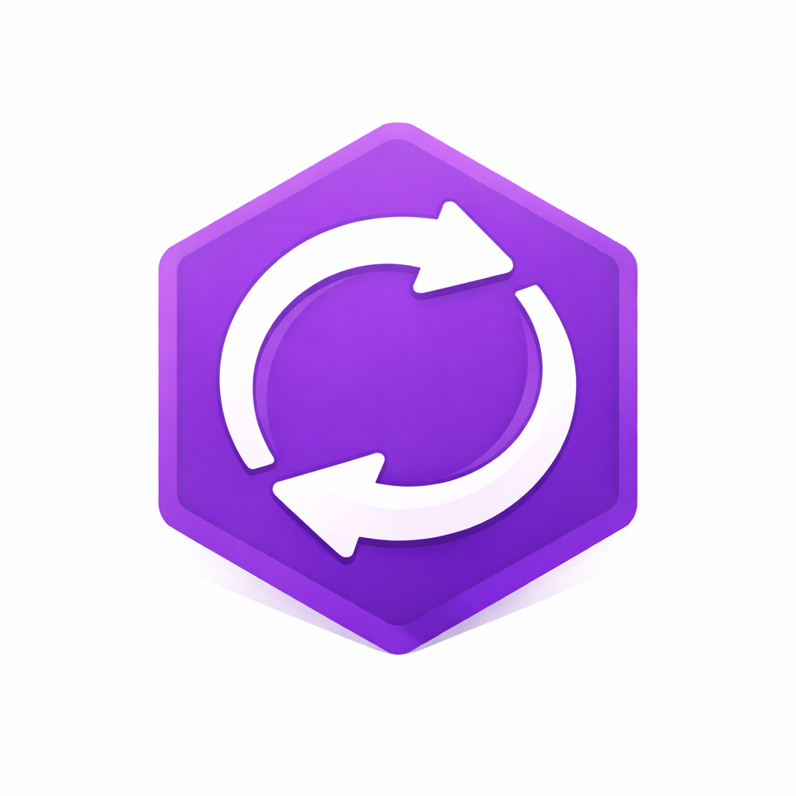

# Graph Sync Template

<p align="center">
  
</p>

<p align="center">
  <a href="https://github.com/wordlift/graph-sync-template/actions/workflows/template-smoke.yml"></a>
  
  
  
  
</p>

Copier template for bootstrapping `worai graph sync` projects with the current WordLift SDK v8 cloud-flow contract.

## Why This Template

Use this repository when you need a new graph sync project with the WordLift runtime contract, GitHub Actions workflow, profile scaffolding, and local examples already aligned.

This template gives you:

- a validated Copier question contract in [`copier.yml`](/Users/ziodave/Developer/wordlift/graph-sync-template/copier.yml)
- a runtime config template in [`worai.toml.jinja`](/Users/ziodave/Developer/wordlift/graph-sync-template/worai.toml.jinja)
- profile scaffolding under [`profiles/`](/Users/ziodave/Developer/wordlift/graph-sync-template/profiles)
- a generated GitHub Actions workflow based on [`.github/workflows/graph-sync.yml`](/Users/ziodave/Developer/wordlift/graph-sync-template/.github/workflows/graph-sync.yml)
- example local runtime code in [`src/acme_kg/postprocessors/youtube.py`](/Users/ziodave/Developer/wordlift/graph-sync-template/src/acme_kg/postprocessors/youtube.py) and [`src/acme_kg/enrichment/youtube.py`](/Users/ziodave/Developer/wordlift/graph-sync-template/src/acme_kg/enrichment/youtube.py)
- smoke coverage and maintenance tests for the template itself

## Quick Start

Generate from the local checkout:

```bash
copier copy . ../my-graph-project
```

Generate from GitHub:

```bash
copier copy gh:wordlift/graph-sync-template my-graph-project
```

For offline or automation-friendly generation, skip API-key validation explicitly:

```bash
copier copy --data validate_api_key=false gh:wordlift/graph-sync-template my-graph-project
```

## Template Contract

### Required inputs

- `api_key`
- `source_type` with one of: `urls`, `sitemap`, `google_sheets`

### Source-specific inputs

- `urls`: `urls`
- `sitemap`: `sitemap_url`, optional `sitemap_url_pattern`
- `google_sheets`: `sheets_url`, `sheets_name`, `sheets_service_account`

### Runtime defaults baked into the template

- `overwrite = true`
- `materialization_backend = "worph"`
- `canonical_id_strategy = "dependency_graph"`
- `concurrency = 4`
- `ingest_loader = "web_scrape_api"`
- `ingest_timeout_ms = 120000`
- `google_search_console = false`
- `profiles = ["default"]`
- `default_profile = "default"`
- `validate_api_key = true`

## What Generation Does

During `copier copy`, the template:

- validates the WordLift API key against `/accounts/me` by default
- derives the runtime package name from the returned `dataset_uri`
- renames the local runtime package from `acme_kg` to `<dataset>_graph_sync`
- writes secrets to a local `.env` instead of tracked config
- sets generated `pyproject.toml` `[project].name` from the destination directory name
- scaffolds `profiles/<profile>/mappings`, `templates`, and `postprocessors`
- removes `.copier-answers.yml` and excludes `copier.yml` from generated output

If validation is skipped or the API is unreachable, the fallback package name is `acme_graph_sync`.

## Generated Project Shape

Generated projects include:

- `worai.toml`
- `.github/workflows/graph-sync.yml`
- `.env`
- `profiles/<profile>/mappings`
- `profiles/<profile>/templates`
- `profiles/<profile>/postprocessors`

Generated projects do not include template-maintenance assets such as:

- `copier.yml`
- `.github/workflows/template-smoke.yml`
- [`tests/test_runtime_assets.py`](/Users/ziodave/Developer/wordlift/graph-sync-template/tests/test_runtime_assets.py)
- [`tests/test_template_smoke.py`](/Users/ziodave/Developer/wordlift/graph-sync-template/tests/test_template_smoke.py)
- [`tests/test_youtube_runtime.py`](/Users/ziodave/Developer/wordlift/graph-sync-template/tests/test_youtube_runtime.py)

## Runtime Compatibility

The template is aligned to the SDK v8 cloud-flow contract:

- `wordlift-sdk>=8.0.14,<9.0.0`
- explicit `ingest_source`
- explicit `ingest_loader`
- explicit `ingest_timeout_ms`
- no legacy `web_page_import_mode` or `web_page_import_timeout` fallback keys

## Static Template Rules

Static entity templates in generated projects must follow these constraints:

- one static template file defines exactly one subject node
- no blank nodes
- explicit IRIs only
- `schema:url` and `schema:sameAs` must be URL literals
- filenames use depth prefixes such as `10_`, `20_`, `30_`
- exported root IRIs in `exports.toml(.j2)` remain stable and unhashed

Default scaffold examples:

- `profiles/default/templates/20_organization.ttl.j2`
- `profiles/default/templates/20_website.ttl.j2`
- `profiles/default/templates/40_organization_postal_address.ttl.j2`

## Development

This repository uses:

- Python `3.12`
- `uv` for dependency management
- `pytest` for verification

Install dependencies:

```bash
uv sync --dev
```

Run the template-maintenance test suite:

```bash
uv run pytest -q
```

Run the render smoke check:

```bash
uv run scripts/smoke_render_template.sh
```

## Maintainer Macros

- `deploy release [major|minor|patch]` (default: `patch`)
  - `scripts/deploy_release.sh [major|minor|patch]`
  - bumps version, refreshes dependencies and lockfile, requires docs/spec updates, then commits, tags, and pushes (including tags)

- `upgrade project`
  - `scripts/upgrade_project.sh`
  - updates `wordlift-sdk` to latest, updates `.github/workflows/graph-sync.yml` to latest `wordlift/graph-sync` tag, then runs `deploy release patch`

## Repository Map

- [`docs/INDEX.md`](/Users/ziodave/Developer/wordlift/graph-sync-template/docs/INDEX.md)
- [`docs/QUICKSTART.md`](/Users/ziodave/Developer/wordlift/graph-sync-template/docs/QUICKSTART.md)
- [`docs/TEMPLATE_SETUP.md`](/Users/ziodave/Developer/wordlift/graph-sync-template/docs/TEMPLATE_SETUP.md)
- [`docs/WORAI_TOML_EXAMPLES.md`](/Users/ziodave/Developer/wordlift/graph-sync-template/docs/WORAI_TOML_EXAMPLES.md)
- [`docs/STATE_OF_ART.md`](/Users/ziodave/Developer/wordlift/graph-sync-template/docs/STATE_OF_ART.md)
- [`specs/INDEX.md`](/Users/ziodave/Developer/wordlift/graph-sync-template/specs/INDEX.md)
- [`specs/graph-sync/overview.md`](/Users/ziodave/Developer/wordlift/graph-sync-template/specs/graph-sync/overview.md)
- [`specs/graph-sync/agent-working-agreement.md`](/Users/ziodave/Developer/wordlift/graph-sync-template/specs/graph-sync/agent-working-agreement.md)

## CI

The template-maintenance workflow lives in [`.github/workflows/template-smoke.yml`](/Users/ziodave/Developer/wordlift/graph-sync-template/.github/workflows/template-smoke.yml). It:

- installs dependencies with `uv`
- runs `uv run pytest -q`
- runs `uv run scripts/smoke_render_template.sh`

Generated projects receive [`.github/workflows/graph-sync.yml`](/Users/ziodave/Developer/wordlift/graph-sync-template/.github/workflows/graph-sync.yml), which exposes profile-based manual dispatch and reusable workflow inputs.
